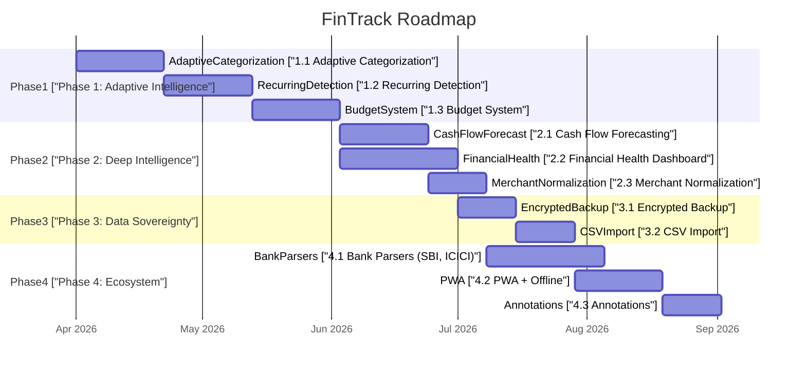

# Privacy-First Financial Intelligence Platform Roadmap

## Current State Assessment

FinTrack today is a functional but shallow tool: PDF upload, keyword-based categorization, and four chart types. The main friction points are:

- **Categorization accuracy is low** -- substring matching on ~80 keywords, no learning from user corrections
- **No forward-looking intelligence** -- only retrospective aggregation (last N months)
- **No budgeting or goal-setting** -- the app describes spending but cannot plan it
- **Only 2 bank parsers** (HDFC, Federal) -- limits addressable user base
- **No data portability** -- no export, backup, or restore mechanism
- **Two navigation items (`/summary`, `/settings`) link to non-existent pages**

---

## Phase 1: Adaptive Intelligence Layer (High Impact, Medium Effort)

### 1.1 Self-Learning Categorization Engine

**What:** Replace the static substring matcher with an adaptive engine that learns from every user correction. When a user manually re-categorizes a transaction, the system extracts discriminating tokens from the description and persists them as `UserCategoryRule` entries automatically, without asking.

**How it works (client + server):**

- On each `PATCH /api/transactions/[id]` with a category change, the server-side handler runs a **token extraction pipeline**: split description into meaningful tokens (UPI ID segments, merchant name fragments via `extractMerchant`, numeric-stripped words), filter stopwords, and auto-create `UserCategoryRule` rows for the top 1-2 discriminating tokens.
- Introduce a **confidence score** on categorization: user rules = 1.0, system rules = weighted by specificity (longer keyword = higher score). Surface this in the UI as a subtle indicator so users know which categorizations to trust.
- Backfill becomes smarter: re-runs with the enriched user rule set, not just system rules.

**Privacy Justification:** All learning stays in the user's own `UserCategoryRule` table. No telemetry, no shared model, no cross-user data. The "model" is the user's own correction history.

**Key files:** `[src/lib/categorization/engine.ts](src/lib/categorization/engine.ts)`, `[src/app/api/transactions/[id]/route.ts](src/app/api/transactions/[id]/route.ts)`, `[src/lib/categorization/merchantExtractor.ts](src/lib/categorization/merchantExtractor.ts)`

---

### 1.2 Recurring Transaction Detection

**What:** Automatically identify repeating transactions (subscriptions, EMIs, salary, rent) by analyzing description similarity + amount consistency + temporal periodicity.

**How it works:**

- New server-side module `src/lib/intelligence/recurrence-detector.ts`:
  1. Group transactions by normalized merchant (from `extractMerchant`)
  2. Within each group, check if amounts are identical (or within 2% tolerance for variable bills)
  3. Detect periodicity: compute intervals between consecutive dates, classify as weekly/monthly/quarterly
  4. Output: `{ merchant, amount, frequency, nextExpectedDate, confidence }`
- New DB model `**RecurringPattern`**: `userId`, `merchantPattern`, `amount`, `frequency` (enum: weekly/monthly/quarterly/annual), `lastSeen`, `nextExpected`, `categoryId`, `isActive`
- API endpoint `GET /api/transactions/recurring` returns detected patterns
- Dashboard widget shows upcoming expected debits for the next 30 days

**Privacy Justification:** Detection runs on the user's own transaction history in their own DB rows. No external service, no behavioral profiling. Patterns are never shared or aggregated.

---

### 1.3 Budget & Envelope System

**What:** Per-category monthly spending limits with real-time progress tracking and threshold alerts.

**How it works:**

- New DB model `**Budget`**: `userId`, `categoryId` (nullable for "total"), `monthlyLimit` (Decimal), `alertThreshold` (default 0.8), `isActive`, `createdAt`
- New page at `/dashboard/budgets` (fills the currently dead `/dashboard/summary` nav slot or adds a new nav item)
- API: `GET/POST/PATCH/DELETE /api/budgets`
- Dashboard integration: each category card in the breakdown shows a progress bar against budget. Overspend shown in red.
- Analytics enhancement: "Budget vs Actual" comparison chart (bar chart with budget line overlay)

**Privacy Justification:** Budget targets are user-defined numbers stored alongside their existing data. No income verification, no credit scoring, no external data enrichment.

---

## Phase 2: Deep Financial Intelligence (High Impact, High Effort)

### 2.1 Cash Flow Forecasting

**What:** Project future cash flow 30/60/90 days out based on detected recurring patterns + historical averages.

**How it works:**

- Leverages Phase 1.2 recurring detection as the foundation
- New module `src/lib/intelligence/forecast.ts`:
  - **Fixed component:** Sum of all active recurring debits/credits projected forward
  - **Variable component:** Category-level monthly average (weighted toward recent 3 months) for non-recurring spend
  - Output: daily projected balance curve with confidence bands
- New chart on dashboard: "Projected Cash Flow" line chart with shaded uncertainty region
- All computation is a pure function over the user's own transaction history -- no external data

**Privacy Justification:** Forecasting is deterministic math over the user's own data. No third-party APIs, no income estimation services, no behavioral prediction models.

---

### 2.2 Financial Health Dashboard

**What:** A dedicated `/dashboard/summary` page (currently a dead nav link) that provides deeper analytical views.

**Metrics to surface:**

- **Savings Rate:** `(credits - debits) / credits` per month, trended over 6-12 months
- **Spending Velocity:** Are you spending faster or slower than last month at the same point in time?
- **Category Trends:** Sparklines per category showing 6-month trajectory (rising/falling/stable)
- **Anomaly Detection:** Flag transactions where amount exceeds 3x the median for that merchant/category
- **Discretionary vs Non-Discretionary Split:** Categories tagged as essential (bills, EMI, groceries) vs discretionary (shopping, entertainment, dining); ratio tracked over time
- **Month-over-Month and Year-over-Year Comparisons:** Side-by-side spending breakdowns

**Key implementation notes:**

- Extend `getAnalyticsSummary` in `[src/lib/analytics.ts](src/lib/analytics.ts)` or create a parallel `getFinancialHealth` function
- Add category metadata field `isEssential` (boolean) to the `Category` model to power the discretionary split
- Anomaly detection: compute per-merchant median + stddev from historical transactions, flag outliers

**Privacy Justification:** All metrics derived from existing local DB data. Anomaly detection uses the user's own spending distribution, not population-level benchmarks.

---

### 2.3 Smart Merchant Normalization & Enrichment

**What:** Transform raw bank descriptions like `UPI-ZOMATO-ZOMATO@PAYTM-PAYTM-123456` into clean merchant identities: "Zomato" with a consistent icon and category memory.

**How it works:**

- New client-side module `src/lib/intelligence/merchant-normalizer.ts`:
  - Parse UPI, NEFT, IMPS, POS prefixes (extending current `extractMerchant`)
  - Apply normalization rules: strip payment processor suffixes, handle common aliases (SWIGGY/BUNDL, UBER/UBEREATS)
  - Build a local **merchant dictionary** as a `Map<normalizedName, { displayName, defaultCategory, transactionCount }>` from the user's own history
- New DB model `**MerchantAlias`**: `userId`, `rawPattern`, `displayName`, `categoryId` -- user can customize
- UI: Transaction list shows cleaned merchant names; long-press/hover shows original raw description

**Privacy Justification:** No merchant database fetched from a server. The normalization rules are deterministic string transforms shipped as static code. The merchant dictionary builds entirely from the user's own transactions.

---

## Phase 3: Data Sovereignty & Portability (Medium Impact, Medium Effort)

### 3.1 Zero-Knowledge Encrypted Backup & Restore

**What:** Let users export all their data as an AES-256-GCM encrypted file, using a passphrase of their choosing. The server never sees the plaintext export.

**How it works:**

- New client-side module `src/lib/export/encrypted-backup.ts`:
  - `GET /api/export/data` returns the user's full dataset (transactions, categories, rules, budgets, recurring patterns) as JSON
  - Client derives an AES-256 key from user passphrase via PBKDF2 (100k iterations)
  - Encrypts JSON with `SubtleCrypto.encrypt` (AES-GCM)
  - Downloads as `.fintrack` file (base64 payload + salt + IV in header)
- Restore: upload `.fintrack` file, enter passphrase, decrypt client-side, preview data, POST to import endpoint
- Settings page (`/dashboard/settings` -- currently dead nav link) hosts this

**Privacy Justification:** The export is encrypted before it leaves the browser. The passphrase is never transmitted. The `.fintrack` file is opaque to anyone without the passphrase, including the server operator.

---

### 3.2 Universal CSV/Excel Import

**What:** A fallback import path for banks without a dedicated PDF parser. Users paste or upload a CSV with configurable column mapping.

**How it works:**

- New client-side parser in `src/lib/csv/`:
  - Parse CSV (Papa Parse or custom) entirely in browser
  - **Column mapper UI:** User maps CSV columns to FinTrack fields (date, description, debit, credit, balance) via dropdowns, with auto-detection heuristics (column header matching)
  - Date format selector (DD/MM/YYYY, MM/DD/YYYY, YYYY-MM-DD, etc.)
  - Preview table identical to current PDF preview flow
  - Reuses existing `POST /api/transactions` bulk endpoint
- Add a tab or toggle on the upload page: "PDF Statement" | "CSV / Excel"

**Privacy Justification:** Same invariant as PDF -- the file is parsed entirely in the browser. Only extracted transaction rows are sent to the server. The raw file is never uploaded.

---

## Phase 4: Ecosystem & Reach (Lower Priority, High Strategic Value)

### 4.1 Expanded Bank Parser Ecosystem

**Priority parsers (by Indian market share):**

- **SBI** (State Bank of India) -- largest user base
- **ICICI Bank**
- **Axis Bank**
- **Kotak Mahindra**

**Implementation pattern:** Each follows the existing `BankParser` interface in `[src/lib/pdf/types.ts](src/lib/pdf/types.ts)`. The `detect` + `parse` contract is well-defined. Community contributions can be accepted as PRs without touching core logic.

**Stretch idea:** A "Generic Table Parser" that uses heuristics to detect any tabular bank statement format -- find date columns, amount columns, description columns via regex patterns. This would cover ~70% of unsupported banks without bank-specific code.

**Privacy Justification:** Same client-side-only parsing. No PDF bytes ever leave the browser.

---

### 4.2 PWA with Offline Support

**What:** Service worker caching for app shell + transaction data, enabling offline viewing and manual transaction entry that syncs when back online.

**How it works:**

- `next-pwa` or custom service worker for static asset caching
- IndexedDB cache for recent transactions (last 3 months) for offline viewing
- Offline manual transaction queue: store in IndexedDB, sync on reconnect
- Add to Home Screen support with proper `manifest.json`

**Privacy Justification:** Data cached locally on the user's device, same trust boundary as the browser tab. No cloud sync, no push notification server tracking.

---

### 4.3 Transaction Annotations & Attachments

**What:** Let users add notes, tags, and receipt photos to transactions.

**How it works:**

- New fields on Transaction: `notes` (text), `tags` (string array via JSON column or join table)
- Receipt photos: stored as **client-side compressed thumbnails** in the DB as base64 (< 100KB each) or in a user-controlled S3-compatible bucket via presigned URLs configured in settings
- Tag-based filtering alongside existing category filters
- Search extended to include notes and tags

**Privacy Justification:** Notes and tags are user-authored metadata in their own DB. Receipt images, if stored in-DB, never leave the server the user controls. If using external storage, the user configures their own bucket.

---

## Phasing & Priority Matrix

---

## Architecture Impact Summary

**New DB Models:**

- `RecurringPattern` -- detected recurring transactions
- `Budget` -- per-category monthly limits
- `MerchantAlias` -- user-curated merchant name overrides
- Extended `Category` with `isEssential` boolean
- Extended `Transaction` with `notes`, `tags`

**New Client-Side Modules:**

- `src/lib/intelligence/recurrence-detector.ts`
- `src/lib/intelligence/forecast.ts`
- `src/lib/intelligence/merchant-normalizer.ts`
- `src/lib/export/encrypted-backup.ts`
- `src/lib/csv/parser.ts` + `column-mapper.ts`

**New Pages:**

- `/dashboard/summary` (Financial Health Dashboard -- fixes dead nav link)
- `/dashboard/settings` (Encrypted backup/restore, preferences -- fixes dead nav link)
- `/dashboard/budgets` (Budget management)

**New API Routes:**

- `GET /api/transactions/recurring`
- `CRUD /api/budgets`
- `GET /api/export/data`
- `GET /api/analytics/health`

**Privacy Invariants Preserved Across All Phases:**

- No PDF/CSV files are ever sent to the server
- No external APIs are called for data enrichment
- No cross-user data sharing or aggregation
- All ML/intelligence is per-user, deterministic, and explainable
- Encrypted backup uses client-side cryptography; server never sees plaintext exports
- The user's self-hosted PostgreSQL instance remains the single source of truth

