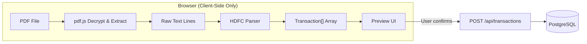

# Phase 2 PRD — Client-Side PDF Parsing Engine

## 1. Executive Summary

**Problem Statement**: Users need to extract transaction data from password-protected HDFC bank statement PDFs, but existing tools either require uploading sensitive files to third-party servers or lack the accuracy needed for Indian bank formats.

**Proposed Solution**: A fully client-side PDF parsing engine that decrypts and extracts transaction data from HDFC bank statement PDFs entirely within the browser. The raw PDF and password never leave the user's device — only structured, user-confirmed transaction data is sent to the server.

**Success Criteria**:
- Parse ≥ 95% of HDFC savings account statement rows correctly
- Complete parsing of a 6-month statement (≈180 transactions) in < 3 seconds
- Zero network requests containing raw PDF data (verifiable via DevTools)
- User can review, edit, and deselect transactions before saving
- Graceful error handling for incorrect passwords, unsupported formats, and corrupted PDFs

---

## 2. User Experience & Functionality

### User Personas

| Persona | Description |
|---|---|
| **Primary** | Privacy-conscious individual who downloads HDFC statements from net banking and wants to track expenses without sharing data with aggregators |
| **Secondary** | User who receives monthly HDFC statements via email and wants a quick way to see spending patterns |

### User Stories

| # | Story | Acceptance Criteria |
|---|---|---|
| US-1 | As a user, I want to upload a bank statement PDF so that I can extract my transactions | ✅ Drag-and-drop or file picker accepts `.pdf` files only<br>✅ File size capped at **4MB** client-side<br>✅ Page count capped at **20 pages** (≈3 months); user prompted to download shorter-range statements for full-year PDFs<br>✅ File stays in browser memory, never uploaded |
| US-2 | As a user, I want to enter the PDF password so that encrypted statements can be parsed | ✅ Password input with show/hide toggle<br>✅ Clear error on wrong password<br>✅ Password never sent to server |
| US-3 | As a user, I want to see parsing progress so that I know the app is working | ✅ Multi-step progress: "Decrypting → Extracting text → Parsing transactions"<br>✅ Animated progress with reassuring privacy message |
| US-4 | As a user, I want to preview extracted transactions before saving | ✅ Table with: Date, Description, Withdrawal, Deposit, Balance<br>✅ Checkbox per row to include/exclude<br>✅ Select all / deselect all<br>✅ Count summary: "24 transactions found, 3 duplicates detected" |
| US-5 | As a user, I want to edit a transaction before confirming | ✅ Inline edit on description, amount, and date<br>✅ Changes reflected in preview before save |
| US-6 | As a user, I want to confirm and save transactions to my account | ✅ "Confirm & Save" button sends only structured JSON<br>✅ Success toast with count<br>✅ Redirect to transactions list |

### Non-Goals (Phase 2)

- ❌ Support for banks other than HDFC (future phases)
- ❌ Credit card statement parsing (different format)
- ❌ OCR for scanned/image-based PDFs
- ❌ Automatic category assignment (Phase 4)
- ❌ Server-side PDF processing of any kind

---

## 3. Technical Specifications

### Architecture Overview



> [!IMPORTANT]
> Everything inside the "Browser" box happens entirely client-side. The only data crossing the network boundary is the structured `Transaction[]` JSON payload after explicit user confirmation.

### Technology Choices

| Component | Choice | Rationale |
|---|---|---|
| PDF text extraction | **pdfjs-dist** (Mozilla's pdf.js) | Industry standard, runs in browser, handles encrypted PDFs natively |
| Text → Transaction parsing | Custom TypeScript parser | Bank-specific regex patterns for HDFC format |
| State management | React `useState` + `useReducer` | Simple, no external dependencies needed |

### HDFC Statement Format

HDFC savings account statements have this tabular structure:

| Date | Narration | Chq./Ref No. | Value Dt | Withdrawal Amt. | Deposit Amt. | Closing Balance |
|---|---|---|---|---|---|---|
| 01/04/25 | UPI-MERCHANT-REF123 | 000012345 | 01/04/25 | 500.00 | | 24,500.00 |
| 02/04/25 | NEFT-SALARY-COMPANY | 000067890 | 02/04/25 | | 50,000.00 | 74,500.00 |

**Parsing strategy**:
- Detect header row by matching column names (case-insensitive)
- Parse each subsequent row using positional column mapping
- Handle multi-line narrations (continuation lines without a date)
- Strip commas from amounts, parse as floats
- Date format: `DD/MM/YY` → ISO 8601

### File Structure

```
src/
├── lib/
│   └── pdf/
│       ├── types.ts            # ParsedTransaction, ParserResult, ParserError types
│       ├── extractor.ts        # pdf.js wrapper: decrypt, extract text lines per page
│       ├── parser-registry.ts  # Bank parser registry and auto-detection
│       └── banks/
│           └── hdfc.ts         # HDFC-specific row parser and header detection
├── app/
│   └── dashboard/
│       └── upload/
│           └── page.tsx        # Upload page with full workflow
└── components/
    └── upload/
        ├── DropZone.tsx        # Drag-and-drop file input
        ├── PasswordInput.tsx   # PDF password field
        ├── ParsingProgress.tsx # Multi-step progress indicator
        └── TransactionPreview.tsx  # Preview table with checkboxes
```

### Data Types

```typescript
interface ParsedTransaction {
  date: string;          // ISO 8601 (YYYY-MM-DD)
  description: string;   // Cleaned narration
  referenceNumber: string;
  amount: number;        // Always positive
  type: "debit" | "credit";
  balance: number;       // Closing balance after this txn
}

interface ParserResult {
  success: boolean;
  bank: string;
  statementPeriod: { from: string; to: string };
  accountNumber: string; // Last 4 digits only (privacy)
  transactions: ParsedTransaction[];
  errors: ParserError[];
}

interface ParserError {
  line: number;
  raw: string;
  reason: string;
}
```

### Integration Points

| Endpoint | Method | Purpose |
|---|---|---|
| `/api/transactions` | POST | Bulk insert confirmed transactions (Phase 3 implements this — Phase 2 stubs it) |

### Security & Privacy

| Concern | Mitigation |
|---|---|
| PDF never leaves browser | File read via `FileReader` API, processed by pdf.js WASM worker — no `fetch()` or `XMLHttpRequest` with file data |
| Password never transmitted | Passed directly to `pdfjsLib.getDocument({ data, password })` in browser memory |
| Account number exposure | Only last 4 digits extracted and stored |
| Memory cleanup | `URL.revokeObjectURL()` called after parsing; file references cleared on component unmount |

---

## 4. Risks & Mitigations

| Risk | Likelihood | Impact | Mitigation |
|---|---|---|---|
| HDFC changes statement format | Medium | High — parser breaks silently | Version-aware parsers with header detection; log unparsed rows for user review |
| pdf.js fails on specific encryption types | Low | Medium | Catch decryption errors, show clear "unsupported encryption" message + link to re-download as unprotected |
| Multi-line narrations cause row misalignment | Medium | Medium | Detect continuation lines (no date prefix) and merge with previous row |
| Large PDFs (>50 pages) slow down browser | Low | Medium | **Hard cap at 20 pages** — reject with message "Please download a shorter statement (e.g. 3 months) from HDFC net banking"; additionally stream pages via pdf.js workers with per-page progress |
| Indian number formats (1,00,000.00) cause parse errors | Medium | High | Regex handles Indian comma grouping (`/[\d,]+\.\d{2}/`) |

---

## 5. Phased Rollout

| Milestone | Scope |
|---|---|
| **Phase 2a (MVP)** | HDFC savings account parser, upload UI, preview table, confirm & save stub |
| **Phase 2b (Polish)** | Error recovery UX, multi-line narration support, edge case hardening |
| **Future** | Additional bank parsers (SBI, ICICI, Axis), credit card formats, parser auto-detection |

---

## 6. Verification Plan

### Automated Tests
- Unit tests for HDFC parser with sample text fixtures (happy path, multi-line narration, edge cases)
- Test password decryption error handling

### Manual / Browser Testing
- Upload a real HDFC statement → verify all rows appear in preview
- Confirm no network requests contain PDF data (DevTools → Network tab)
- Test with wrong password → verify error state
- Test with non-HDFC PDF → verify "unsupported bank" message
- Test file > 10MB → verify rejection
